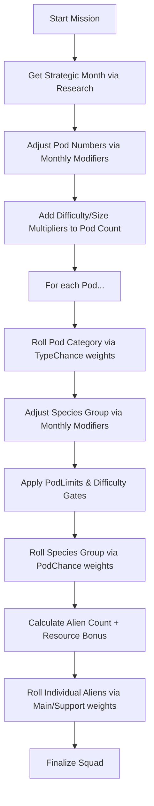

# Strategy AI Deep Dive Report

This report provides a detailed breakdown of the `XGStrategyAI_Mod` logic and its configuration via `DefaultStrategyAIMod.ini`. It covers mission generation, UFO encounters, pod compositions, and the influence of alien strategic variables.

## Core Logic Overview

The mod replaces standard XCOM strategy AI with a more configurable and dynamic system. The logic is primarily driven by three alien "stats":
1.  **Alien Research (`STAT(1)`)**: Controls the progression of time in the mod's eyes, appearing species, leader levels, and pod limits.
2.  **Alien Resources (`STAT(19)`)**: Directly increases the number of aliens per pod.
3.  **Alien Aggression (`STAT(21)`)**: Determines the likelihood of "Ambush UFOs".

---

## UFO & Mission Logic

### UFO Squad Determination
The function `DetermineUFOSquad_Mod` handles UFO-specific logic:
- **Ship Size Influence**: `ShipSize` scales the number of pods (`NumPodsModifier = ShipSize * ShipSizeMultiplier`).
- **Landed vs. Crashed**: Crashed UFOs have fewer pods and aliens, controlled by `CrashedUFOSurviedPodsPercentage` and `CrashedUFOSurvedAliensPercentage`.
- **Ambush UFOs**: If `EnableAmbushUFOs` is true, the game checks Alien Aggression (`STAT(21)`). If an ambush is triggered, the UFO receives bonus pods and aliens (+50%/+25% by default).
- **Command Pods**: UFO missions always include exactly one command pod.

### Mission Difficulty Scaling
- For **Abductions**, difficulty is based on the mission's innate difficulty (0-3).
- For **UFOs**, difficulty is the `ShipSize`.
- For **Special/Story Missions**, difficulty is set to 100, effectively bypassing most difficulty-based probability filters.

---

## Deep Dive: The Pod Rolling Algorithm

The alien squad generation follows a deterministic but statistically weighted sequence. It transitions from high-level mission requirements down to individual alien species selection.

### 1. Determining the "Strategic Month"
The function `GetMonth_Mod` calculates the operative month for modifiers:
```javascript
function int GetMonth_Mod() {
    if (EnableAlienResearch) {
        return STAT_GetStat(1) / 28; // Alien Research divided by 28 days
    }
    return GetMonth(); // Standard calendar month
}
```
> [!NOTE]
> This means if aliens gain research rapidly (e.g., from successful missions), they can "fast-forward" into late-game pod compositions even in early calendar months.

### 2. Rolling Pod Numbers (`RollNumPods`)
1.  **Base Range**: Fetched from mission-specific config (e.g., `AbductionPodNumbers`).
2.  **Monthly Override**: `AdjustPodNumbersByMonth` scans the `MonthlyModifiers` array. It updates the `Min/Max` pods based on the latest entry where `Modifier.Month <= CurrentMonth`.
3.  **Random Roll**: A value is rolled within the (potentially modified) `Min/Max` range.
4.  **Static Modifiers**: UFO ship size or mission difficulty multipliers are then added.

### 3. Selecting Pod Categories (`RollPodTypes`)
Each mission type has a list of `PodTypes` (e.g., Soldier, Terror, Elite) with associated `TypeChance` (weights).
- **Weighted Roll**: All chances are summed, a random number is picked, and a category is selected.
- **Monthly Shift**: `AbductionPodTypesMonthlyModifiers` can shift the "flavor" of a mission over time (e.g., making Terror pods more likely on Abductions later).

### 4. Selecting Species Groupings (`RollPodAliens`)
Once a category (like `EPodTypeMod_Soldier`) is chosen, the mod selects a specific "Species Group" (an index into `PossibleSoldiers`).

#### The Override Hierarchy
The function `AdjustPossibleSpeciesByMonth` performs a critical override check:
1.  **Base Config**: Load defaults from `PossibleSoldiers[ID]`.
2.  **Monthly Modification**: Every parameter (`PodChance`, `MinAliens`, `LeaderLevel`, etc.) can be overridden by `SoldiersMonthlyModifiers`.
3.  **Pod Limits**: If a grouping has a `PodLimit` (e.g., `PodLimit=1`) and has already been rolled for this mission, its `PodChance` is set to `0`.
4.  **Difficulty Gating**: If the grouping's `PodDifficulty` > `MissionDifficulty`:
    - If `DiffDecreaseProbability` is `false`, `PodChance` becomes `0`.
    - If `true`, the chance is divided by `DiffProbabilityDivisor * (DifficultyGap)`.

### 5. Populating the Pod
- **Pod Size**: Base size is rolled between `MinAliens` and `MaxAliens`.
- **Resource Bonus**: If `EnableAlienResources` is on, `STAT(19) * AdditionalAliensPerPodMultiplier` is added to the count.
- **Individual Alien Weights**: For each slot, a weighted roll occurs using `MainChance`, `Support1Chance`, and `Support2Chance`.

---

## configuration Breakdown (`DefaultStrategyAIMod.ini`)

### Key Global Settings
- `SmallestBigUFO`: Defines which ships use the `BigUFOPodTypes`.
- `DiffDecreaseProbability`: If true, pods with a `PodDifficulty` higher than the mission's difficulty have their spawn chance slashed rather than zeroed out.
- `AlwaysSpawnAtLeastOneMainAlien`: Ensures pods aren't empty of their "anchor" species even if RNG rolls poorly.

### Example Pod Configuration
```ini
; Outsiders + Elite Command Pod
PossibleCommanders[4]=(MainAlien=eChar_Outsider,MainChance=50,PodDifficulty=0,SupportAlien1=eChar_Outsider,Support1Chance=100,SupportAlien2=eChar_MutonElite,Support2Chance=100)
```

---

## Summary of Stats Influence

| Stat | Effect | Multiplier |
| :--- | :--- | :--- |
| **Alien Research** | Monthly Modifiers, Leader Lv | `0.025` (Level Max) |
| **Alien Resources**| Pod Size (Count) | `0.0075` (per Resource) |
| **Alien Aggression**| Ambush UFO Chance | `Rand(30) < Aggression` |

---

## Logic Flow Visualization


